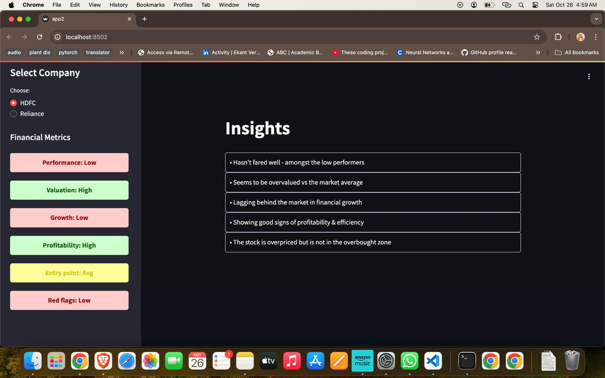

```markdown
# 📈 Quant Trading Prediction Model 📉

Welcome to the **Quantitative Trading Prediction Model** repository! This project combines **Principal Component Analysis (PCA)** for dimensionality reduction and a **short Artificial Neural Network (ANN)** for trading action predictions. 🌟 We use both financial data and **Environmental, Social, and Governance (ESG)** data to bring sustainability into trading. 💹

---

## 🚀 Project Overview

Our model leverages:

- 📊 **Technical Indicators** from historical trading data.
- 🖼️ **Chart Analysis** to identify patterns and trends.
- 🌍 **ESG Metrics** for sustainable investment insights.

With ESG scores, we take a socially-conscious approach that adds depth to traditional quantitative trading models. 🌱

---

## ✨ Features

### 🔄 Data Preprocessing
- **PCA**: Reduces high-dimensional data for faster, more efficient predictions.
- **ESG Data**: Uses MSCI ESG Data API to blend sustainability insights with trading data.

### 🧠 Model Structure
- **Dual-input ANN** architecture with dense layers, batch normalization, and dropout.
- Optimized for **binary action predictions** (e.g., buy/sell) based on market conditions.

---

## 📊 Evaluation
- Tracks **accuracy** and **AUC** (Area Under Curve) during training/testing.
- Includes **visualization tools** for tracking accuracy and loss, providing insights into model performance.

---

## 📋 Requirements

- **Python 3.x**
- **TensorFlow**
- **Scikit-learn**
- **Pandas**
- **Numpy**
- **Matplotlib**

## ⚙️ Installation

To get started with this project:

1. Clone the repository:
   ```bash
   git clone https://github.com/yourusername/quant-trading-prediction-model.git
   ```
2. Navigate to the project directory:
   ```bash
   cd quant-trading-prediction-model
   ```
3. Install all required dependencies:
   ```bash
   pip install -r requirements.txt
   ```

---

## 🌐 ESG Integration

Incorporating **ESG factors** allows us to take a more holistic approach to market analysis, introducing insights on corporate sustainability that can impact long-term performance. This alignment supports **values-based investing**. ♻️

---

## 📈 Results

With enhanced accuracy through ESG data integration, the model provides deeper insights into the market. Performance results and plots are stored in the `/results` folder for easy access.

---

## 📷 Stock Insights and Trading Bot

### 📊 Stock Insights


### 🤖 Trading Bot


---

## 📂 Repository Details

- ⭐ **Stars:** 0
- 👀 **Watchers:** 1
- 🍴 **Forks:** 0
- 🐍 **Languages:** Python 100%

---

## 🤝 Contributing

Contributions are welcome! Feel free to open a pull request or issue to discuss improvements or suggest new features. 😊

---

## 📄 License

This project is licensed under the MIT License. See the [LICENSE](LICENSE) file for details.
```